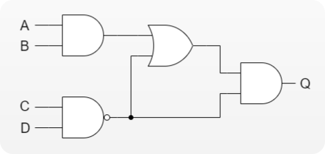

# A C++17 Flow-Based Programming Library 

[](https://github.com/beyse/ExecutionNodes/actions/workflows/windows.yml)
[](https://github.com/beyse/ExecutionNodes/actions/workflows/ubuntu.yml)

ExecutionNodes is a flexible reuse system for C++. This library brings the ability to reuse independent components to create software systems simply by changing their interconnections, but not their internals.
It enables you to follow a software design that is very similar to a micro-service architecture. If you are interested in a comparison, you can take a look [here](#appendix).


By using it, you will have:
* less glue code that connects individual components
* less boiler plate code for instantiating and configuring components

It allows you to:
* change the behaviour of your application at runtime
* exchange components, destroy or create them and change connections between them at runtime
* create a whole new application by reusing and connecting individual components without needing to recompile


ExecutionNodes was built with simplicity in mind! So it is very easy to use.

The library lets you build applications by connecting reusable building blocks (e.g. __*Nodes*__). The connected nodes form a graph which ensures that all nodes are executed in the right order. Because of that it supports parallel execution out of the box.   

Other than most similar libraries out there, ExecutionNodes provides a standard way to: 
* Inject initial information packages into the nodes using JSON 
* Connect the multiple inputs and outputs between nodes using names rather than indices
* Define and load graphs using configuration files in JSON format
* Add and remove connections between ports at any time during runtime
* Add and remove nodes also any time at runtime

## Table of Contents
TBD


## Motivation
I created this library after having worked for almost a decade as C++ software developer with focus on image and signal processing. I noticed that the way code reuse is attempted for processing pipelines is most often flawed in some ways. Even if individual components are well modularized and easily reusable, it takes a lot of effort to just write the boiler plate code which feeds initial information (configuration, calibration, settings, algorithm parameters) from a filesystem to the components. Same is true for the glue code you have to write to pass information from one component to the next ones, often in a chain like fasion.   

Another important observation which lead to the idea behind this library is the fact that
At some point I had to maintain a set of half a dozen applications which all used the same set of components but each arranged them differently to achieve a different behaviour. Maintaining all these "very similar but also different" applications became incrisingly cumbersome and I searched for a solution.

I found my answer in the concept of Flow-based programming, which has already been described many times earlier, including but not limited to Research Engineers at IBM in the 1970s<sup>[[1]](https://en.wikipedia.org/wiki/Flow-based_programming#Concepts)</sup>.

Using A Flow-Based programming approach allows for configurable modularity, which some claim to be a characterizing property of all successful reuse systems<sup>[[2]](https://en.wikipedia.org/wiki/Configurable_modularity)</sup>. 


Haven't found any library online which ticks all the checkmarks I desired, I decided to create my own C++ implementation. 

## Introduction
First, I would like to introduce the main concepts.
There is **nodes**, **ports** and **connections** between them. 

A node can have any number of input ports and any number of output ports. 

Ports can be connected with eachother and they transport information (any C++ object) in and out of a node. Ports can be categorized into input ports and output ports.

You can connect any output port of a node to any number of input ports of any other node. Each input port can have no more than one connection. 

The information that leave and enter the nodes via the ports can be of any datatype you want (as long as it is moveable or copyable).   

Since the nodes and its connections are represented as a directed asyclic graph, the system automatically resolves the dependencies and ensures that nodes are executed in the right order and the data packages are transferred to the right nodes. Because of that, node execution can be parallelized with the snap of your fingers, greatly reducing runtime for computational demanding processing pipelines.


## Features
TBD

## Getting Started
### Integrating the library
### Writing a first example 
Let's say we want to build this simple logic circuit:



Each logic gate (AND, OR, NAND) will be its own reusable software component. Of course, in a real world C++ program every sane mind would pull a one-liner like this: 
```cpp
bool Q = ((A & B) | !(C & D)) & !(C & D);
```

However, the purpose here is to demonstrate how to create nodes and connect them together to form a graph. 

And for this we always need three things:
1. Some nodes you implemented. Each encapsulates some functionality and form a reusable module.
2. Something that describes how the nodes shall be connected and interplay with eachother. It is called a `graphDefinition`
3. A main function which constructs the graph and executes it 

We will start with the last one:

```cpp
#include <execution_nodes/execution_nodes.h> 

using namespace execution_nodes;
static const NodeRegistry registry = { ... } // This will be explained in a moment

int main() {
  // Graph definition can be loaded from a json file
  std::string filePath = "./example1/graph.json";
  GraphDefinition d = loadGraphDefFromJsonFile(filePath);
  // Graph is constructed using the graph definition and the node registry
  Graph graph(d, registry);
  // Now we can execute the graph which runs all nodes
  graph.executeSerial();
}
```
And this is it! This tiny main function can now perform any behaviour we defined
in the file `graph.json`. 

Now, we take a look at what is inside the that `graph.json` file:
```json
{
    "name": "Logic Gates Example",
    "nodes": {
        "random0": {
            "type": "RandomNumberGenerator",
            "settings": {
                "seed": 42
            }
        },
        "random1": {
            "type": "RandomNumberGenerator",
            "settings": {
                "seed": 69
            }
        },
        "adder": {
            "type": "Adder"
        },
        "printer": {
            "type": "NumberPrinter"
        }
    },
    "connections": [
        [ "random0:number" , "adder:a" ],
        [ "random1:number" , "adder:b" ],
        [ "adder:sum" , "printer:number" ]
    ]
}
```
So we can see that we have 4 nodes in there each with a distinct name. The first node is called INSERT NAME HERE and has the type INSERT TYPE HERE. There is also a section definiting the settings for this node. This in literature is sometimes called initial information package. 

The last section is called connections and it contains a complete list of all connections we want to have in this graph.

And how would we implement a Node that plays along in this graph?
Let's take a close look:
```cpp
// Create a class which is derived from Node
class OrGate : public execution_nodes::Node {

public:
  // The constructor must have this signature where it takes a
  // NodeDefinition and a ConnectorPtr
  OrGate(const NodeDefinition &definition, const ConnectorPtr &connector)
      : execution_nodes::Node(definition, connector) {}

  // We must override the execute() method which defines the nodes behaviour
  void execute() override {
    // i0 and i1 will be the inputs of the OR gate.
    bool i0, i1;
    // we obtain values for i0 and i1 by calling getInput.
    getInput("i0", i0); // The first argument is the name of the port.
    getInput("i1", i1); // The second arguments tells where the value should go to. Just by convention it is best to keep the variable names and port names identical. But this is technically not necessary at all. 

    // Do our OR operation, simple enough
    bool o = i0 || i1;
    // Set the result at the output port of the node
    setOutput("o", o);
  }
};
```

That is it! The other gates we saw can be implemented in exactly the same way.
But we are missing one last important concept, which is the settings we saw earlier in the `graph.json`. 
Settings are extremely useful to inject information into the node at construction which can be used to determined the nodes behaviour.

```cpp
class RandomBool : public execution_nodes::Node 
{

public:
  RandomBool(const NodeDefinition &definition, const ConnectorPtr &connector)
      : execution_nodes::Node(definition, connector) 
  {
    // Simply call getSetting<>() and provide the key of the setting. 
    uint64_t seed = getSetting<uint64_t>("seed");
  }
```

The last piece missing is the NodeRegistry. In order for the graph to know how to construct a node of type "OrGate" we need to register it in the factory.
Gladly, doing so is as easy as:
```cpp
static const NodeRegistry registry = {
    REGISTER(RandomBool),  // Use the macro REGISTER to register the name of the node to the class name
    REGISTER(AndGate2),    //
    REGISTER(OrGate2),     //
    REGISTER(NotGate),     //
    REGISTER(NamedBoolPrinter), //
};
```


## Examples


## Build


## Appendix

The table below clarifies the difference between Micro-Service Architectures and this library.

|  | Micro-Service Architecture  |  ExecutionNodes |
|---|---|---|
|  Distribution  | Services run in their own process. Often on separate machines. |  All nodes run in the same process  |
|  Communication  | Services typically exchange information over TCP using REST interfaces   |  Nodes share the same address space and exchange information by copying or referencing C++ objects. You could also exchange smart pointers to objects  |
|  Language  | Can be any programming language and any number of languages   |  C++  |
|  Loose Coupling  | Yes   |  Yes  |

