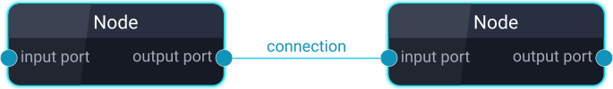
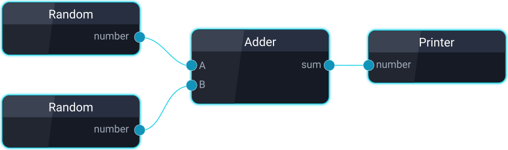

# A C++17 Flow-Based Programming Library 

[](https://github.com/beyse/ExecutionNodes/actions/workflows/windows.yml)
[](https://github.com/beyse/ExecutionNodes/actions/workflows/ubuntu.yml)

ExecutionNodes is a flexible reuse system for C++. It is based on the idea of [flow-based programming](https://en.wikipedia.org/wiki/Flow-based_programming). The library lets you build applications by connecting reusable building blocks called `Nodes`. The nodes and their connections form a graph which can be executed. The library supports parallel execution out of the box.

You can think of it as a library that enables a micro-service architecture. Click [here](#appendix) if you are interested in a brief comparison. 

By using it, you will have:
* less glue code that connects individual components
* less boiler plate code for instantiating and configuring components

It allows you to:
* reuse independent components by changing their interconnections, but not their internals. Even at runtime!
* exchange components, destroy or create them and change connections between them.

ExecutionNodes was built with simplicity in mind! It is easy to use. 

## Table of Content

- [Why ExecutionNodes](#why-executionnodes)
- [Motivation](#motivation)
- [Introduction](#introduction)
- [How to Build on Windows](#how-to-build-on-windows)
    - [Prerequisits](#prerequisits-1)
    - [Build](#build-1)
- [How to Build on Linux](#how-to-build-on-linux)
    - [Prerequisits](#prerequisits-2)
    - [Build](#build-2)
- [Integrating the library](#integrating-the-library)
- [Using the Library](#using-the-library)
- [User Documentation](#user-documentation)
- [Tests](#tests)
- [Examples](#examples)
- [Building Graphs using a Node Editor](#building-graphs-using-a-node-editor)
- [Appendix](#appendix)

## Why ExecutionNodes?

Other than most similar libraries out there, ExecutionNodes provides a standard way to: 
* Inject initial information packages into the nodes using JSON 
* Connect the multiple inputs and outputs between nodes using names rather than indices
* Define and load graphs using configuration files in JSON format. Nothing has to be hard coded!
* Add and remove connections between ports at any time during runtime
* Add and remove nodes also any time at runtime
## Motivation
With over a decade as C++ Software Developer I found the way code reuse is attempted for processing pipelines is most often flawed in some ways. Even if individual components are well modularized and easily reusable, it takes a lot of effort to write the boiler plate code which feeds initial information (configuration, calibration, settings, algorithm parameters) from a filesystem to the components. Same is true for the glue code which must be written to pass information from one component to the next ones, often in a chain-like fasion.   

Flow-based programming is not new. It has been discussed and implemented many times earlier, including but not limited to Research Engineers at IBM in the 1970s<sup>[[1]](https://en.wikipedia.org/wiki/Flow-based_programming#Concepts)</sup>.

Using A Flow-Based programming approach allows for configurable modularity, which some claim to be a characterizing property of all successful reuse systems<sup>[[2]](https://en.wikipedia.org/wiki/Configurable_modularity)</sup>. 

I am aware of standards like [OpenVX](https://en.wikipedia.org/wiki/OpenVX), the [OpenCV Graph API](https://docs.opencv.org/4.x/d6/dc9/gapi_purposes.html) or libraries like [CppFBP](https://github.com/jpaulm/cppfbp) and [taskflow](https://github.com/taskflow/taskflow). They all have their pros and cons, however I wanted that this library
* is easy to use
* is lightweight and modern (yes [boost](https://www.boost.org/), I am looking at you)
* allows you to re-use existing classes by wrapping them rather than having to integrate existing code into a new ecosystem.

Most importantly I enjoyed writing the library :)  

## Introduction
First, I would like to introduce the main concepts.
There are `nodes`, which have `ports` and they have `connections` between them. 
Ports are categorized into `input ports` and `output ports`.




Ports can be connected with eachother and they transport information (any C++ object) in and out of a node. 

A node can have any number of input ports and any number of output ports. Be aware nodes without ports are useless.

You can connect any output port of a node to any number of input ports of any other node. Each input port can only have no connect or exactly one connection. 

The information that leave and enter the nodes via the ports can be of any datatype (as long as it is moveable or copyable).   

Since the nodes and its connections are represented as a directed asyclic graph, the system automatically resolves the dependencies and ensures that nodes are executed in the right order and the data packages are transferred to the right nodes. Because of that, node execution can be parallelized with the snap of your fingers, greatly reducing runtime for many computational demanding processing tasks.


## How to Build on Windows
I used Windows 11
### Prerequisits

- Visual Studio 2019 or higher. You can get it from https://visualstudio.microsoft.com/de/downloads/

- CMake. You can get it from https://cmake.org/download/

### Build
Run the build script
```
.\build.bat
```

## How to Build on Linux
I used Ubuntu 20.04.

### Prerequisits
- Build Tools for Linux
```
sudo apt-get update
sudo apt-get install build-essential
```

- CMake. You can get it from https://cmake.org/download/

### Build
Run the build shell script
```
./build-ubuntu.sh
```

## Integrating the library

You can integrate the library into your project using CMake like this: 
```cmake
set(LIB_EXECUTION_NODES_DIR "./3rdparty/ExecutionNodes" CACHE PATH "The path to a folder containing this git repository")
add_subdirectory(${LIB_EXECUTION_NODES_DIR} ${LIB_EXECUTION_NODES_DIR}/bin)
target_include_directories(YourProject PRIVATE ${LIB_EXECUTION_NODES_DIR}/include/public)
target_link_libraries(YourProject PRIVATE lib_execution_nodes)
```

If you would like to see a working example, you can take a look at [CvSubsystem](https://github.com/beyse/ExecutionSubsystems/tree/main/CvSubsystem)

## Using the Library
Let's say we want to build this simple graph:



Each node (Random Number, Adder, Printer) will be a reusable software component. Of course, in a real world C++ program every sane mind would pull a one-liner like this: 
```cpp
std::cout << rand() + rand();
```
To print the sum of two random numbers, however the purpose here is to demonstrate how to use the library. 

Three things are required:
1. Some nodes you implemented. Each encapsulates a functionality and form a reusable module.
2. Something that describes how the nodes shall be connected and interplay with eachother. It is called a `graphDefinition`
3. A main function which constructs the graph and executes it 

We will start with the last one:

```cpp
#include <execution_nodes/execution_nodes.h> 

using namespace execution_nodes;
static const NodeRegistry registry = { ... } // This will be explained in a moment

int main() {
  // Graph definition can be loaded from a json file
  std::string filePath = "./example1/graph.json";
  GraphDefinition d = loadGraphDefFromJsonFile(filePath);
  // Graph is constructed using the graph definition and the node registry
  Graph graph(d, registry);
  // Now we can execute the graph which runs all nodes
  graph.executeSerial();
}
```
And this is it! This tiny main function can now perform any behaviour we defined
in the file `graph.json`. 

Now, we take a look at what is inside the that `graph.json` file:
```json
{
    "name": "Arithmetic Example",
    "nodes": {
        "random0": {
            "type": "RandomNumberGenerator",
            "settings": {
                "seed": 42
            }
        },
        "random1": {
            "type": "RandomNumberGenerator",
            "settings": {
                "seed": 69
            }
        },
        "adder": {
            "type": "Adder"
        },
        "printer": {
            "type": "NumberPrinter"
        }
    },
    "connections": [
        [ "random0:number" , "adder:a" ],
        [ "random1:number" , "adder:b" ],
        [ "adder:sum" , "printer:number" ]
    ]
}
```
So we can see that we have 4 nodes in there each with a distinct name. The first node is called `random0` and is of type `RandomNumberGenerator`. There is also a section definiting the settings for this node. This in literature is sometimes called initial information package. 

The last section is called connections and it contains a complete list of all connections we want to have in this graph.

And how would we implement a Node that plays along in this graph?
Let's take a close look:
```cpp
// Create a class which is derived from Node
class Adder : public execution_nodes::Node {

public:
  // The constructor must have this signature where it takes a
  // NodeDefinition and a ConnectorPtr
  Adder(const NodeDefinition &definition, const ConnectorPtr &connector)
      : execution_nodes::Node(definition, connector) {}
  // We must override the execute() method which defines the nodes behaviour
  void execute() override {
    // a and b will be the input of the adder.
    float a = 0, b = 0;
    // We obtain values for a and b by calling getInput.
    getInput("a", a);
    getInput("b", b);
    // Do the calculation
    float sum = a + b;
    // Set the result at the output port of the node
    setOutput("sum", sum);
  }
};
```

That is it! The other gates we saw can be implemented in exactly the same way.

But we are missing one last important concept, which is the settings we saw earlier in the `graph.json`. 
Settings are extremely useful to inject information into the node at construction which can be used to determined the nodes behaviour.
For this we take a look at the `RandomNumberGenerator` which has the `seed` setting.

```cpp
class RandomNumberGenerator : public execution_nodes::Node 
{

public:
  RandomNumberGenerator(const NodeDefinition &definition, const ConnectorPtr &connector)
      : execution_nodes::Node(definition, connector) 
  {
    // Simply call getSetting<>() and provide the key of the setting. 
    uint64_t seed = getSetting<uint64_t>("seed");
  }
...
```

The last piece missing is the NodeRegistry. In order for the graph to know how to construct a node of type "OrGate" we need to register it in the factory.
Gladly, doing so is as easy as:
```cpp
static const NodeRegistry registry = {
    REGISTER(Adder),  // Use the macro REGISTER to register the name of the node to the class name
    REGISTER(RandomNumberGenerator),    //
    REGISTER(Printer),     //
};
```
## User Documentation
The library comes with doxygen documentation.

## Tests
The library comes with unit tests using the [Catch](https://github.com/catchorg/Catch2) library.
There is no automated way of presenting the code coverage on this GitHub page yet. At the time of writing the tests cover 86% of the lines of code.

## Examples
The library comes with these usage examples:
* [Airthmetic](https://github.com/beyse/ExecutionNodes/tree/main/examples/example_arithmetic)  
* [Logic Gates](https://github.com/beyse/ExecutionNodes/tree/main/examples/example_logic_gates)
* [Image Processing](https://github.com/beyse/ExecutionNodes/tree/main/examples/example_image_processing)

Please note that these examples are still work in progress at the time of writing.

A much more comprehensive usage example can be found in the
* [CvSubsystem](https://github.com/beyse/ExecutionSubsystems/tree/main/CvSubsystem) git repository

It uses OpenCV to implements a number of image processing nodes.

## Building Graphs using a Node Editor

If you like to use a graphical node editor to connect nodes and build a graph rather than editing JSON files, you can use the one in this git repository: 

* [Node Editor](https://github.com/beyse/NodeEditor)

## Appendix

The table below clarifies the difference between Micro-Service Architectures and this library.

|  | Micro-Service Architecture  |  ExecutionNodes |
|---|---|---|
|  Distribution  | Services run in their own process. Sometimes on separate machines. |  All nodes run in the same process  |
|  Communication  | Services typically exchange information over TCP using REST interfaces   |  Nodes share the same address space and exchange information by copying or referencing native C++ objects. You could also exchange smart pointers to objects  |
|  Language  | Can be any programming language and any number of languages   |  C++  |
|  Loose Coupling  | Yes   |  Yes  |


[](https://www.buymeacoffee.com/beyse)
